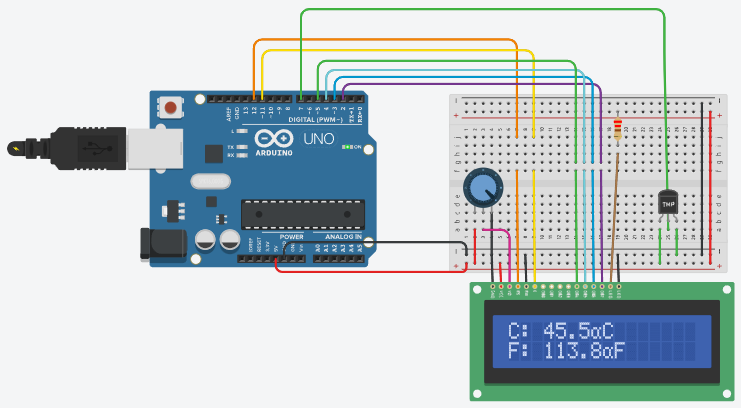
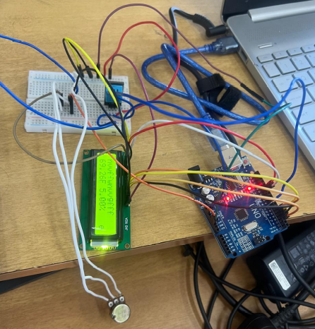
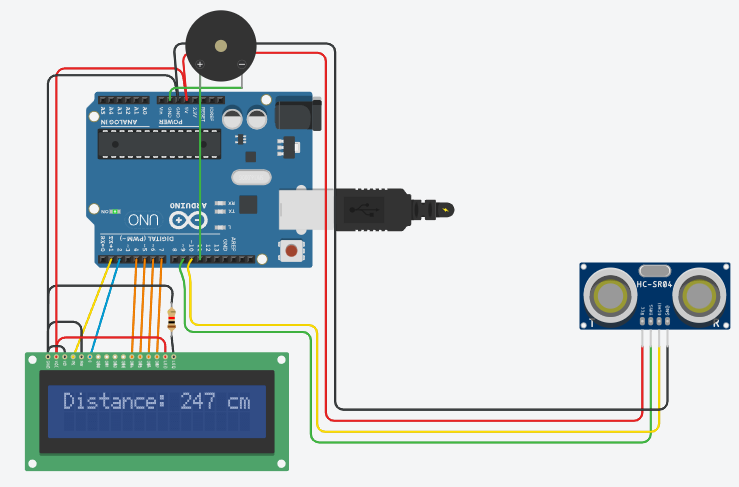
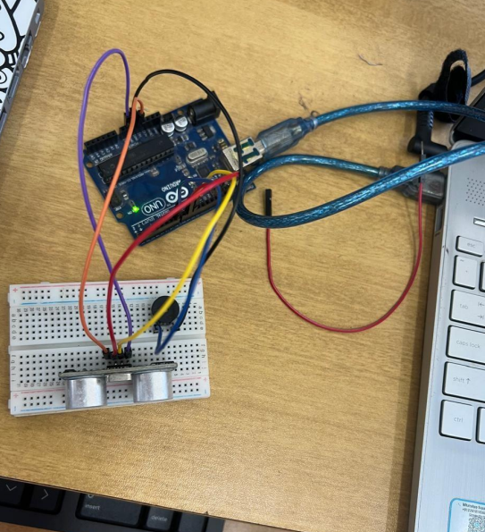
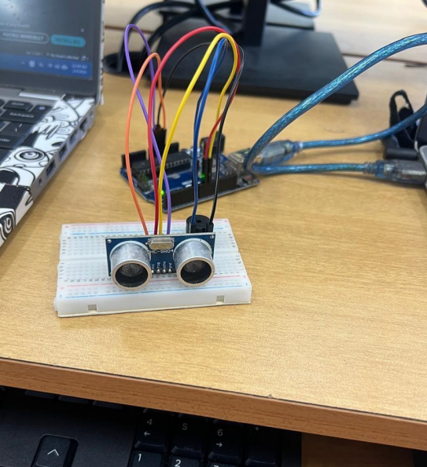
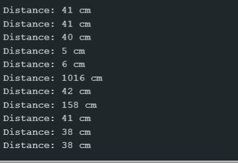
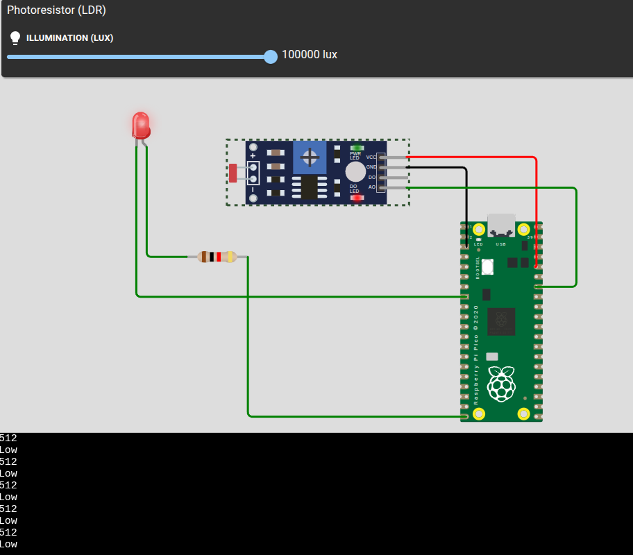
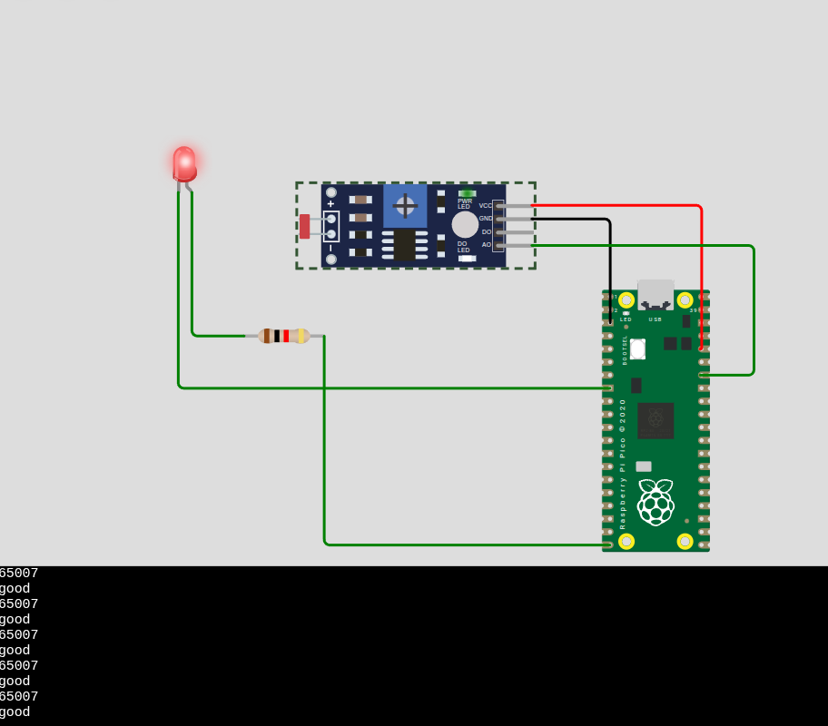
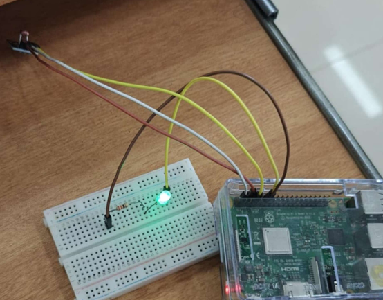

<div align="center">

# 🚦 2-Way Railway Crossing Traffic Signal Mechanism

### An Arduino-based Automatic Traffic Control System for Railway Level Crossings

[](https://www.arduino.cc/)
[](https://www.arduino.cc/reference/en/)
[](https://www.tinkercad.com/)
[](#)
[](https://github.com/Nandhakish0r/Internet_of_Things-projects/tree/main/Railway_Crossing_Traffic_Signal_mechanism)

</div>

---

## 📌 Overview

This project simulates a **2-Way Railway Level Crossing Traffic Signal** using an **Arduino UNO**. The system automatically controls road-side traffic signals at a railway level crossing — halting vehicles when a train is passing and releasing them when the track is clear.

It models real-world railway gate logic using **5 LEDs** (Red, Yellow, Green for road + Green, Red for train) controlled in a timed cyclic sequence, making the system safe, predictable, and fully automatic.

---

## 🧠 Concept & Working Principle

At a **level crossing**, road vehicles and trains share the same intersection point. The core challenge:

- 🚗 **Stop road traffic** when a train is approaching or passing
- ✅ **Allow road traffic** to move when the crossing is clear
- 🔄 **Cycle continuously** to keep the intersection safe at all times

### State Machine Logic

The system runs through **4 states** in a loop, each lasting **2 seconds**:

```
┌─────────┬─────────────────┬──────────────────┬──────────────────────────────────┐
│  State  │   Road Signal   │  Train Signal    │  Meaning                         │
├─────────┼─────────────────┼──────────────────┼──────────────────────────────────┤
│    1    │  🔴 RED         │  🟢 GREEN        │  Train passing — road blocked    │
│    2    │  🟡 YELLOW      │  🟢 GREEN        │  Train clearing — road preparing │
│    3    │  🟢 GREEN       │  🔴 RED          │  Crossing clear — road open      │
│    4    │  🟢 GREEN       │  🔴 RED          │  Road about to close             │
└─────────┴─────────────────┴──────────────────┴──────────────────────────────────┘
                              ↓ Repeat from State 1
```

> ⚠️ **Note:** No physical sensor is used in this version. The system runs on a **timed loop** to demonstrate the signal cycling logic. In a real deployment, IR sensors or reed switches would detect the train and trigger state transitions dynamically.

---

## 🔌 Circuit Diagram (Tinkercad Simulation)

> The circuit was first designed and tested on **Tinkercad Circuits** before building the physical prototype.

| View 1 | View 2 | View 3 |
|:------:|:------:|:------:|
|  |  |  |

*Fig 1 — Tinkercad simulation: Arduino UNO driving Traffic Light LEDs and Train Signal LEDs via breadboard*

### 📍 Pin Configuration

| Pin | LED Color | Signal Group | Function |
|:---:|:---------:|:------------:|:---------|
| `11` | 🔴 Red | ROAD | Road — Stop |
| `12` | 🟡 Yellow | ROAD | Road — Caution |
| `10` | 🟢 Green | ROAD | Road — Go |
| `9` | 🟢 Green | TRAIN | Train — Track Clear |
| `8` | 🔴 Red | TRAIN | Train — Approaching |

---

## 🛠️ Hardware Setup

> Physical build using **Arduino UNO**, **5 LEDs**, **220Ω resistors**, and a **breadboard**.

| View 1 | View 2 | View 3 |
|:------:|:------:|:------:|
|  |  |  |

*Fig 2 — Physical hardware: Arduino UNO with road + train LED signal circuit on breadboard*

---

## 🧰 Components Required

| Component | Qty | Purpose |
|-----------|:---:|---------|
| Arduino UNO | 1 | Main microcontroller |
| Red LED | 2 | Road Red + Train Red |
| Yellow LED | 1 | Road Yellow (caution) |
| Green LED | 2 | Road Green + Train Green |
| 220Ω Resistor | 5 | Current limiting per LED |
| Breadboard | 1 | Prototyping base |
| Jumper Wires | ~15 | Connections |
| USB Type-B Cable | 1 | Power + code upload |

---

## 💻 Arduino Code

```cpp
void setup() {
  // Road Signal Pins
  pinMode(11, OUTPUT);  // RED
  pinMode(12, OUTPUT);  // YELLOW
  pinMode(10, OUTPUT);  // GREEN

  // Train Signal Pins
  pinMode(9, OUTPUT);   // GREEN (track clear)
  pinMode(8, OUTPUT);   // RED   (train approaching)
}

void loop() {

  // ── STATE 1: Train Passing | Road → STOP ────────────────────
  digitalWrite(11, HIGH);  // ROAD  RED    → ON
  digitalWrite(12, LOW);   // ROAD  YELLOW → OFF
  digitalWrite(10, LOW);   // ROAD  GREEN  → OFF
  digitalWrite(9,  HIGH);  // TRAIN GREEN  → ON  (clear to pass)
  digitalWrite(8,  LOW);   // TRAIN RED    → OFF
  delay(2000);

  // ── STATE 2: Train Clearing | Road → WAIT ───────────────────
  digitalWrite(11, LOW);   // ROAD  RED    → OFF
  digitalWrite(12, HIGH);  // ROAD  YELLOW → ON
  digitalWrite(10, LOW);   // ROAD  GREEN  → OFF
  digitalWrite(9,  HIGH);  // TRAIN GREEN  → ON  (still moving)
  digitalWrite(8,  LOW);   // TRAIN RED    → OFF
  delay(2000);

  // ── STATE 3: Crossing Clear | Road → GO ─────────────────────
  digitalWrite(11, LOW);   // ROAD  RED    → OFF
  digitalWrite(12, LOW);   // ROAD  YELLOW → OFF
  digitalWrite(10, HIGH);  // ROAD  GREEN  → ON
  digitalWrite(9,  LOW);   // TRAIN GREEN  → OFF
  digitalWrite(8,  HIGH);  // TRAIN RED    → ON  (no train)
  delay(2000);

  // ── STATE 4: Road Closing Soon | Road → PREPARE ─────────────
  digitalWrite(11, LOW);   // ROAD  RED    → OFF
  digitalWrite(12, LOW);   // ROAD  YELLOW → OFF
  digitalWrite(10, HIGH);  // ROAD  GREEN  → ON  (last chance)
  digitalWrite(9,  LOW);   // TRAIN GREEN  → OFF
  digitalWrite(8,  HIGH);  // TRAIN RED    → ON  (train incoming)
  delay(2000);

  // → Loops back to STATE 1
}
```

---

## 🚀 How to Run

### Option A — Simulate on Tinkercad *(No hardware needed)*

1. Go to [tinkercad.com](https://www.tinkercad.com) → **Circuits** → **Create new Circuit**
2. Drag in **Arduino UNO** + **5 LEDs** + **5 × 220Ω resistors** onto the breadboard
3. Wire each LED anode → resistor → Arduino pins `8, 9, 10, 11, 12`; cathodes to GND
4. Click **Code** → paste the Arduino code above
5. Click **Start Simulation** — watch signals cycle

### Option B — Upload to Physical Arduino

1. Install [Arduino IDE](https://www.arduino.cc/en/software)
2. Build the circuit on breadboard per the pin config table above
3. Connect Arduino UNO via USB
4. Open Arduino IDE → paste the code
5. **Tools → Board:** `Arduino UNO` | **Tools → Port:** select correct COM/tty port
6. Click **Upload** (`Ctrl+U`)
7. LEDs begin cycling through the 4 signal states automatically

---

## 📊 Signal State Summary

| State | Road | Train | Situation | Duration |
|:-----:|:----:|:-----:|-----------|:--------:|
| 1 | 🔴 RED | 🟢 GREEN | Train passing — road fully blocked | 2 sec |
| 2 | 🟡 YELLOW | 🟢 GREEN | Train clearing — road about to open | 2 sec |
| 3 | 🟢 GREEN | 🔴 RED | Crossing clear — vehicles may pass | 2 sec |
| 4 | 🟢 GREEN | 🔴 RED | Road closing soon — train incoming | 2 sec |

---

## 🔍 Limitations & Future Scope

**Current Limitations**
- Timer-based only — no real train detection
- Fixed 2-second delays regardless of actual train speed
- No physical gate barrier mechanism

**Future Enhancements**
- 🔭 **IR / Reed switch sensors** — detect actual train presence and trigger state change dynamically
- 🚧 **Servo motor gate** — physical barrier arm that lifts/drops automatically
- 🔔 **Buzzer alarm** — audio warning when train is approaching
- 🖥️ **LCD display** — "TRAIN APPROACHING" / "SAFE TO CROSS" messages
- 📡 **ESP8266/ESP32** — IoT integration for remote monitoring and alerts

---

## 👤 Author

**Nandakishor** — Electronics & Communication Engineering
IIIT Kottayam | VLSI & Embedded Systems

[](https://github.com/Nandhakish0r)
[](https://github.com/Nandhakish0r/Internet_of_Things-projects)

---

<div align="center">

*Built with Arduino UNO · Part of the IoT Projects series*

</div>
<div align="center">

<div align="center">

<div align="center">

# 🌡️ Temperature Monitoring System with LCD Display

### An Arduino-based Real-Time Temperature & Humidity Monitor using DHT11 Sensor and 16×2 LCD

[](https://www.arduino.cc/)
[](https://www.arduino.cc/reference/en/)
[](#)
[](https://www.tinkercad.com/)
[](#)
[](https://github.com/Nandhakish0r/Internet_of_Things-projects)

</div>

---

## 📌 Overview

This project builds a **real-time temperature and humidity monitoring system** using an **Arduino UNO**, a **DHT11 digital sensor**, and a **16×2 LCD display**. The system continuously reads ambient temperature in both **Celsius** and **Fahrenheit** alongside **relative humidity** — updating every 2 seconds.

It demonstrates core IoT concepts: **digital sensor communication**, **single-wire protocol**, **library-based sensor interfacing**, and **real-time LCD output**.

---

## 🧠 Concept & Working Principle

The **DHT11** is a digital temperature and humidity sensor that uses a **single-wire serial protocol** to send calibrated data to the microcontroller. Unlike analog sensors, no ADC conversion is needed — the Arduino receives ready-to-use digital values via the `DHT` library.

### How DHT11 Works

```
┌──────────────┐   Single-Wire    ┌────────────────────┐   DHT library   ┌──────────────────┐
│  DHT11       │  Digital Signal  │   Arduino UNO      │ ──────────────► │  tempC, tempF,   │
│  Sensor      │ ───────────────► │   (Digital Pin)    │                 │  humidity values │
│  (Temp+Hum)  │                  │                    │                 └────────┬─────────┘
└──────────────┘                  └────────────────────┘                          │
                                                                                  ▼
                                                                       ┌──────────────────────┐
                                                                       │   16×2 LCD Display   │
                                                                       │  Row 0: T:25.0C 77F  │
                                                                       │  Row 1: H: 60%       │
                                                                       └──────────────────────┘
```

### DHT11 Sensor Specs

| Parameter | Value |
|-----------|-------|
| Interface | Single-wire digital |
| Temperature Range | 0°C to 50°C |
| Temperature Accuracy | ±2°C |
| Humidity Range | 20% to 90% RH |
| Humidity Accuracy | ±5% RH |
| Sampling Rate | 1 reading per second (use ≥ 2s delay) |
| Operating Voltage | 3.3V – 5V |

### LCD Display Output

```
┌─────────────────┐
│ T:25.0C  77.0F  │   ← Row 0: Temperature (°C and °F)
│ H: 60%          │   ← Row 1: Relative Humidity
└─────────────────┘
  (Updates every 2 seconds)
```

---

## 🔌 Circuit Diagram (Tinkercad Simulation)

> The circuit was first designed and tested on **Tinkercad Circuits** before physical implementation.

<div align="center">



*Fig 1 — Tinkercad simulation: Arduino UNO + DHT11 sensor + 16×2 LCD on breadboard*

</div>

### 📍 Pin Configuration

| Arduino Pin | Connected To | Purpose |
|:-----------:|:------------:|:--------|
| `7` | DHT11 Data | Digital temperature & humidity data |
| `5V` | DHT11 VCC | Sensor power supply |
| `GND` | DHT11 GND | Sensor ground |
| `12` | LCD RS | Register Select |
| `11` | LCD E | Enable |
| `5` | LCD D4 | Data bit 4 |
| `4` | LCD D5 | Data bit 5 |
| `3` | LCD D6 | Data bit 6 |
| `2` | LCD D7 | Data bit 7 |
| `5V` | LCD VCC | LCD power supply |
| `GND` | LCD GND | LCD ground |
| `10kΩ pot` | LCD V0 | LCD contrast control |

> **Note:** A **10kΩ pull-up resistor** between DHT11 Data pin and 5V is recommended for stable readings.

---

## 🛠️ Hardware Setup

> Physical build using **Arduino UNO**, **DHT11 sensor**, **16×2 LCD**, **10kΩ potentiometer**, and a **breadboard**.

<div align="center">



*Fig 2 — Physical hardware: Arduino UNO with DHT11 temperature & humidity sensor and 16×2 LCD display*

</div>

---

## 🧰 Components Required

| Component | Qty | Purpose |
|-----------|:---:|---------|
| Arduino UNO | 1 | Main microcontroller |
| DHT11 Sensor | 1 | Digital temperature & humidity sensing |
| 16×2 LCD Display | 1 | Display temperature and humidity |
| 10kΩ Potentiometer | 1 | LCD contrast adjustment |
| 10kΩ Resistor | 1 | Pull-up for DHT11 data line |
| Breadboard | 1 | Prototyping base |
| Jumper Wires | ~20 | Connections |
| USB Type-B Cable | 1 | Power + code upload |

---

## 💻 Arduino Code

> Requires the **DHT sensor library** by Adafruit. Install via Arduino IDE: `Sketch → Include Library → Manage Libraries → search "DHT sensor library"`.

```cpp
#include <LiquidCrystal.h>
#include <DHT.h>

// LCD pin mapping: RS, E, D4, D5, D6, D7
LiquidCrystal lcd(12, 11, 5, 4, 3, 2);

#define DHTPIN  7         // DHT11 data pin connected to digital pin 7
#define DHTTYPE DHT11     // Sensor type: DHT11

DHT dht(DHTPIN, DHTTYPE); // Initialize DHT sensor object

void setup() {
  lcd.begin(16, 2);           // Initialize 16-column, 2-row LCD
  dht.begin();                // Start DHT11 sensor
  lcd.print("Temp & Humidity"); // Splash screen
  delay(2000);
  lcd.clear();
}

void loop() {
  float humidity = dht.readHumidity();         // Read humidity (%)
  float tempC    = dht.readTemperature();      // Read temperature in Celsius
  float tempF    = dht.readTemperature(true);  // Read temperature in Fahrenheit

  // Check for failed readings
  if (isnan(humidity) || isnan(tempC) || isnan(tempF)) {
    lcd.setCursor(0, 0);
    lcd.print("Sensor Error!   ");
    lcd.setCursor(0, 1);
    lcd.print("Check wiring    ");
    delay(2000);
    return;
  }

  // Row 0: Temperature (Celsius and Fahrenheit)
  lcd.setCursor(0, 0);
  lcd.print("T:");
  lcd.print(tempC, 1);        // 1 decimal place
  lcd.print((char)223);       // Degree ° symbol (ASCII 223)
  lcd.print("C ");
  lcd.print(tempF, 1);
  lcd.print((char)223);
  lcd.print("F");

  // Row 1: Humidity
  lcd.setCursor(0, 1);
  lcd.print("H: ");
  lcd.print(humidity, 1);     // 1 decimal place
  lcd.print("%       ");      // Trailing spaces clear old digits

  delay(2000);                // DHT11 needs minimum 2s between reads
}
```

---

## 🚀 How to Run

### Option A — Simulate on Tinkercad *(No hardware needed)*

1. Go to [tinkercad.com](https://www.tinkercad.com) → **Circuits** → **Create new Circuit**
2. Add **Arduino UNO** + **DHT11 sensor** + **16×2 LCD** + **10kΩ potentiometer**
3. Wire per the pin configuration table above; add 10kΩ pull-up on DHT11 data pin
4. Click **Code** → switch to **Text** mode → paste the Arduino code
5. Click **Start Simulation** → adjust potentiometer for LCD contrast
6. Click on DHT11 in simulation → adjust temperature/humidity sliders to see live readings

### Option B — Upload to Physical Arduino

1. Install [Arduino IDE](https://www.arduino.cc/en/software)
2. Install DHT library: **Sketch → Include Library → Manage Libraries** → search `DHT sensor library` by Adafruit → Install (also install `Adafruit Unified Sensor` when prompted)
3. Build the circuit on breadboard per pin config table
4. Connect Arduino UNO via USB
5. Open Arduino IDE → paste the code
6. **Tools → Board:** `Arduino UNO` | **Tools → Port:** select correct COM/tty port
7. Click **Upload** (`Ctrl+U`)
8. LCD shows splash "Temp & Humidity" for 2 seconds, then live readings begin

---

## 📊 DHT11 Reading Reference

| Condition | Temp (°C) | Temp (°F) | Humidity (%) |
|-----------|:---------:|:---------:|:------------:|
| Cold room | 15.0 | 59.0 | 40% |
| Room temperature | 25.0 | 77.0 | 55% |
| Warm room | 35.0 | 95.0 | 70% |
| Hot & humid | 45.0 | 113.0 | 85% |

> **DHT11 vs DHT22:** DHT11 is lower cost with ±2°C accuracy. DHT22 offers wider range (−40°C to +80°C) and ±0.5°C accuracy — a drop-in upgrade for this project.

---

## 🔍 Limitations & Future Scope

**Current Limitations**
- DHT11 limited to 0°C – 50°C range with ±2°C accuracy
- No data logging — readings are display-only
- Minimum 2-second sampling interval (sensor hardware constraint)
- No threshold-based alert or alarm

**Future Enhancements**
- 🔔 **Buzzer alert** — trigger when temperature or humidity exceeds threshold
- 📊 **Serial plotter** — visualize trends via Arduino Serial Monitor
- 💾 **SD card module** — log timestamped readings locally
- 📡 **ESP8266/ESP32** — push data to cloud (ThingSpeak, Blynk) for remote monitoring
- 🌡️ **DHT22 upgrade** — wider range and higher accuracy drop-in replacement

---

## 👤 Author

**Nandakishor** — Electronics & Communication Engineering  
IIIT Kottayam | VLSI & Embedded Systems

[](https://github.com/Nandhakish0r)
[](https://github.com/Nandhakish0r/Internet_of_Things-projects)

---

<div align="center">

*Built with Arduino UNO · Part of the IoT Projects series*

</div>
<div align="center">

# 🔊 Ultrasonic Sensor Based Intruder Detection System

### An Arduino-based Proximity-Triggered Security System with Buzzer, LED & Relay Actuation

[](https://www.arduino.cc/)
[](https://www.arduino.cc/reference/en/)
[](#)
[](https://www.tinkercad.com/)
[](#)
[](https://github.com/Nandhakish0r/Internet_of_Things-projects)

</div>

---

## 📌 Overview

This project implements an **ultrasonic sensor-based intruder detection and actuation system** using an **Arduino UNO** and an **HC-SR04 ultrasonic sensor**. When an object or person enters within a defined proximity threshold (30 cm), the system triggers a **buzzer alarm**, activates an **LED indicator**, and optionally engages a **relay** for external device control (locks, sirens, etc.).

Distance readings are continuously logged to the **Serial Monitor** and displayed on a **16×2 LCD**, making the system suitable for embedded security, access control, and proximity sensing applications.

---

## 🧠 Concept & Working Principle

The **HC-SR04** measures distance using **ultrasonic sound waves**. It emits a 40kHz pulse from the TRIG pin and listens for the echo on the ECHO pin. The time taken for the pulse to return is used to calculate distance.

### Distance Measurement Pipeline

```
┌─────────────┐  10µs pulse  ┌──────────────┐  Sound wave  ┌────────────┐
│  Arduino    │ ────────────► │  HC-SR04     │ ────────────► │  Object   │
│  TRIG Pin 9 │              │  TRIG        │              └─────┬──────┘
└─────────────┘              └──────────────┘                    │ Echo
                                                                  ▼
┌─────────────┐  pulseIn()   ┌──────────────┐  duration × 0.034 / 2
│  Arduino    │ ◄──────────── │  HC-SR04     │ ──────────────────────► Distance (cm)
│  ECHO Pin 10│              │  ECHO        │
└─────────────┘              └──────────────┘
```

### Detection Logic

```
┌──────────────────────────────────────────────────┐
│           Distance Measurement Loop              │
│                                                  │
│   distance < 30 cm ?                             │
│         │                                        │
│    YES ──┼──► LED ON + BUZZER ON + RELAY ON      │
│         │     (Intruder Detected!)               │
│    NO  ──┼──► LED OFF + BUZZER OFF + RELAY OFF   │
│               (Zone Clear)                       │
└──────────────────────────────────────────────────┘
         ↓ Repeat every 200ms
```

### HC-SR04 Sensor Specs

| Parameter | Value |
|-----------|-------|
| Interface | Digital (TRIG + ECHO) |
| Operating Voltage | 5V DC |
| Measuring Range | 2 cm – 400 cm |
| Accuracy | ±3 mm |
| Trigger Pulse Width | 10 µs |
| Ultrasonic Frequency | 40 kHz |
| Beam Angle | ~15° |

---

## 🔌 Circuit Diagram (Tinkercad Simulation)

> The circuit was first designed and tested on **Tinkercad Circuits** before physical implementation.

<div align="center">



*Fig 1 — Tinkercad simulation: Arduino UNO + HC-SR04 + Buzzer + LED + Relay on breadboard*

</div>

### 📍 Pin Configuration

| Arduino Pin | Connected To | Purpose |
|:-----------:|:------------:|:--------|
| `9` | HC-SR04 TRIG | Trigger pulse output |
| `10` | HC-SR04 ECHO | Echo pulse input |
| `6` | Buzzer (+) | Alarm buzzer |
| `5` | LED (+) | Intruder indicator LED |
| `7` | Relay IN | Optional relay (lock/siren) |
| `5V` | HC-SR04 VCC + LCD VCC | Power supply |
| `GND` | HC-SR04 GND + all GND | Ground |
| `1` | LCD RS | Register Select |
| `2` | LCD E | Enable |
| `4` | LCD D4 | Data bit 4 |
| `5` | LCD D5 | Data bit 5 |
| `6` | LCD D6 | Data bit 6 |
| `7` | LCD D7 | Data bit 7 |

---

## 🛠️ Hardware Setup

> Physical build using **Arduino UNO**, **HC-SR04 ultrasonic sensor**, **buzzer**, **LED**, **relay module**, and a **breadboard**.

| View 1 | View 2 | View 3 |
|:------:|:------:|:------:|
|  |  |  |

*Fig 2 — Physical hardware: Arduino UNO with HC-SR04 ultrasonic sensor, breadboard, and actuation components*

---

## 🧰 Components Required

| Component | Qty | Purpose |
|-----------|:---:|---------|
| Arduino UNO | 1 | Main microcontroller |
| HC-SR04 Ultrasonic Sensor | 1 | Distance measurement |
| Active Buzzer | 1 | Audio alarm on detection |
| LED (Red) | 1 | Visual intruder indicator |
| Relay Module (5V) | 1 | Trigger external alarm/lock (optional) |
| 220Ω Resistor | 1 | Current limiting for LED |
| 16×2 LCD Display | 1 | Display live distance readings |
| Breadboard | 1 | Prototyping base |
| Jumper Wires | ~20 | Connections |
| USB Type-B Cable | 1 | Power + code upload |

---

## 💻 Arduino Code

### Hardware Code (with Serial Monitor + LED + Buzzer + Relay)

```cpp
#define TRIG_PIN   9
#define ECHO_PIN   10
#define BUZZER_PIN 6
#define LED_PIN    5
#define RELAY_PIN  7   // Optional: activate external lock/alarm

long duration;
int  distance;

void setup() {
  pinMode(TRIG_PIN,   OUTPUT);
  pinMode(ECHO_PIN,   INPUT);
  pinMode(BUZZER_PIN, OUTPUT);
  pinMode(LED_PIN,    OUTPUT);
  pinMode(RELAY_PIN,  OUTPUT);

  digitalWrite(BUZZER_PIN, LOW);
  digitalWrite(LED_PIN,    LOW);
  digitalWrite(RELAY_PIN,  LOW);

  Serial.begin(9600);
}

void loop() {
  // ── Trigger ultrasonic pulse ─────────────────────────────
  digitalWrite(TRIG_PIN, LOW);
  delayMicroseconds(2);
  digitalWrite(TRIG_PIN, HIGH);
  delayMicroseconds(10);
  digitalWrite(TRIG_PIN, LOW);

  // ── Read echo and calculate distance ────────────────────
  duration = pulseIn(ECHO_PIN, HIGH);
  distance = duration * 0.034 / 2;    // Speed of sound: 0.034 cm/µs, divide by 2 (round trip)

  Serial.print("Distance: ");
  Serial.print(distance);
  Serial.println(" cm");

  // ── Intruder detection: trigger if within 30 cm ─────────
  if (distance > 0 && distance < 30) {
    digitalWrite(LED_PIN,    HIGH);   // LED ON
    digitalWrite(BUZZER_PIN, HIGH);   // Buzzer ON
    digitalWrite(RELAY_PIN,  HIGH);   // Relay ON (activate lock/alarm)
    delay(500);
  } else {
    digitalWrite(LED_PIN,    LOW);    // LED OFF
    digitalWrite(BUZZER_PIN, LOW);    // Buzzer OFF
    digitalWrite(RELAY_PIN,  LOW);    // Relay OFF
  }

  delay(200);  // Polling interval
}
```

### Tinkercad Code (with LCD Display)

```cpp
#define BUZZER_PIN 6
#include <LiquidCrystal.h>

// LCD pin mapping: RS, E, D4, D5, D6, D7
LiquidCrystal lcd(1, 2, 4, 5, 6, 7);

const int trigPin = 9;
const int echoPin = 10;
long duration;
int  distance;

void setup() {
  lcd.begin(16, 2);              // 16-col, 2-row LCD
  pinMode(trigPin, OUTPUT);
  pinMode(echoPin, INPUT);
  pinMode(BUZZER_PIN, OUTPUT);
}

void loop() {
  // ── Trigger pulse ────────────────────────────────────────
  digitalWrite(trigPin, LOW);
  delayMicroseconds(2);
  digitalWrite(trigPin, HIGH);
  delayMicroseconds(10);
  digitalWrite(trigPin, LOW);

  // ── Calculate distance ───────────────────────────────────
  duration = pulseIn(echoPin, HIGH);
  distance = duration * 0.034 / 2;

  // ── Display on LCD ───────────────────────────────────────
  lcd.setCursor(0, 0);
  lcd.print("Distance: ");
  lcd.print(distance);
  lcd.print(" cm  ");           // Trailing spaces clear old digits

  // ── Buzzer alert if intruder within 30 cm ───────────────
  if (distance > 0 && distance < 30) {
    digitalWrite(BUZZER_PIN, HIGH);
    delay(500);
  } else {
    digitalWrite(BUZZER_PIN, LOW);
  }

  delay(200);
}
```

> **Bug fix note:** The original condition `distance < 0 && distance > 30` is logically impossible (a number cannot be both negative and greater than 30 simultaneously). Corrected to `distance > 0 && distance < 30` — triggers alarm when object is between 0 and 30 cm.

---

## 🚀 How to Run

### Option A — Simulate on Tinkercad *(No hardware needed)*

1. Go to [tinkercad.com](https://www.tinkercad.com) → **Circuits** → **Create new Circuit**
2. Add **Arduino UNO** + **HC-SR04** + **Buzzer** + **16×2 LCD** on breadboard
3. Wire per the pin configuration table above
4. Click **Code** → switch to **Text** mode → paste the **Tinkercad code** above
5. Click **Start Simulation** → move an object near the HC-SR04 in simulation
6. LCD updates live distance; buzzer triggers when object is within 30 cm

### Option B — Upload to Physical Arduino

1. Install [Arduino IDE](https://www.arduino.cc/en/software)
2. Build circuit on breadboard per pin config table
3. Connect Arduino UNO via USB
4. Open Arduino IDE → paste the **Hardware code** above
5. **Tools → Board:** `Arduino UNO` | **Tools → Port:** select correct COM/tty port
6. Click **Upload** (`Ctrl+U`)
7. Open **Serial Monitor** (`Ctrl+Shift+M`) at **9600 baud** → watch live distance readings
8. Bring hand within 30 cm of HC-SR04 → LED + buzzer + relay activate

---

## 📊 Serial Monitor Output (Sample)

```
Distance: 43 cm    → Clear
Distance: 41 cm    → Clear
Distance: 5 cm     → ⚠️ INTRUDER DETECTED (Buzzer + LED ON)
Distance: 6 cm     → ⚠️ INTRUDER DETECTED
Distance: 42 cm    → Clear
Distance: 38 cm    → Clear
```

---

## 🔍 Limitations & Future Scope

**Current Limitations**
- Fixed 30 cm threshold — not adjustable without code change
- No data logging or timestamped event records
- HC-SR04 beam angle (~15°) may miss objects outside the cone
- Single-zone detection only

**Future Enhancements**
- 🎛️ **Potentiometer threshold** — adjust detection range dynamically without re-uploading
- 📱 **GSM/ESP8266 alert** — send SMS or push notification when intruder detected
- 📷 **Camera module** — capture image on detection trigger
- 🗺️ **Multi-zone coverage** — multiple HC-SR04 sensors covering wider area
- 💾 **SD card logging** — timestamped intruder event records
- 📡 **IoT dashboard** — real-time monitoring via ThingSpeak or Blynk

---

## 👤 Author

**Nandakishor** — Electronics & Communication Engineering  
IIIT Kottayam | VLSI & Embedded Systems

[](https://github.com/Nandhakish0r)
[](https://github.com/Nandhakish0r/Internet_of_Things-projects)

---

<div align="center">

*Built using Arduino UNO · Part of the IoT Projects series*

</div>
<div align="center">

# 💡 LDR Based Automatic Light Control System

### A Raspberry Pi Pico-based Ambient Light Sensor that Automatically Turns LED On in Dark

[](https://www.raspberrypi.com/products/raspberry-pi-pico/)
[](https://micropython.org/)
[](#)
[](https://wokwi.com/)
[](#)
[](https://github.com/Nandhakish0r/Internet_of_Things-projects)

</div>

---

## 📌 Overview

This project implements an **automatic light control system** using a **Raspberry Pi Pico**, an **LDR (Light Dependent Resistor) sensor module**, and a **red LED**. The system continuously monitors ambient light levels — when it gets dark, the LED turns **ON** automatically; when light is detected, the LED turns **OFF**.

It demonstrates core IoT concepts: **digital sensor reading**, **threshold-based actuation**, and **automatic environmental response** — similar to how streetlights and night lamps operate in real life.

---

## 🧠 Concept & Working Principle

An **LDR (Light Dependent Resistor)** decreases in resistance as light intensity increases. The **LDR sensor module** outputs a **Digital Signal (DO)** — LOW when dark, HIGH when bright — based on a threshold set by the onboard potentiometer. The Raspberry Pi Pico reads this digital signal and controls the LED accordingly.

### Working Pipeline

```
┌─────────────────┐   Light falls on LDR   ┌──────────────────────┐
│  Ambient Light  │ ─────────────────────► │  LDR Sensor Module   │
│  (Environment)  │                         │  DO: LOW  = Dark     │
└─────────────────┘                         │  DO: HIGH = Bright   │
                                            └──────────┬───────────┘
                                                       │ GP27 (DO)
                                                       ▼
                                            ┌──────────────────────┐
                                            │  Raspberry Pi Pico   │
                                            │  digital_val = DO    │
                                            └──────────┬───────────┘
                                                       │
                                    ┌──────────────────┴──────────────────┐
                                    │                                     │
                              DO == 0 (LOW)                         DO == 1 (HIGH)
                               (DARK)                                 (BRIGHT)
                                    │                                     │
                                    ▼                                     ▼
                           ┌────────────────┐                  ┌────────────────┐
                           │  LED ON (GP0)  │                  │  LED OFF (GP0) │
                           └────────────────┘                  └────────────────┘
```

### LDR Sensor Module Specs

| Parameter | Value |
|-----------|-------|
| Output Type | Digital (DO) |
| Operating Voltage | 3.3V – 5V |
| Digital Threshold | Adjustable via onboard potentiometer |
| DO Logic | LOW = Dark, HIGH = Bright |
| ADC Range (AO) | 0 – 65535 (16-bit on Pico) |

### Observed ADC Values (from Simulation)

| Condition | ADC Reading | DO Signal | LED State |
|-----------|:-----------:|:---------:|:---------:|
| Bright (100000 lux) | ~65007 | HIGH | 🔴 OFF |
| Dark (0 lux) | ~512 | LOW | 🔴 ON |

---

## 🔌 Circuit Diagram (Wokwi Simulation)

> The circuit was first designed and tested on **Wokwi** before physical implementation.

| Normal Mode | Dark Mode (LED ON) |
|:-----------:|:------------------:|
|  |  |

*Fig 1 — Wokwi simulation: Raspberry Pi Pico + LDR sensor module + Red LED (left: bright, right: dark → LED ON)*

### 📍 Pin Configuration

| Pico Pin | Connected To | Purpose |
|:--------:|:------------:|:--------|
| `GP0` | LED Anode (+) | LED control output |
| `GND` | LED Cathode (−) via 220Ω | LED ground |
| `GP27` | LDR DO | Digital light threshold signal |
| `3V3` | LDR VCC | Sensor power supply |
| `GND` | LDR GND | Sensor ground |

> **Note:** Only the **DO (Digital Output)** pin is used. The AO (Analog Output) pin is left unconnected. Pico ADC pins are limited to **GP26, GP27, GP28** — GP21 has no ADC capability.

---

## 🛠️ Hardware Setup

> Physical build using **Raspberry Pi Pico**, **LDR sensor module**, **LED**, **220Ω resistor**, and jumper wires.

<div align="center">



*Fig 2 — Physical hardware: Raspberry Pi Pico with LDR sensor module and red LED*

</div>

---

## 🧰 Components Required

| Component | Qty | Purpose |
|-----------|:---:|---------|
| Raspberry Pi Pico | 1 | Main microcontroller (MicroPython) |
| LDR Sensor Module | 1 | Ambient light detection (digital output) |
| Red LED | 1 | Visual output indicator |
| 220Ω Resistor | 1 | Current limiting for LED |
| Breadboard | 1 | Prototyping base |
| Jumper Wires | ~8 | Connections |
| Micro-USB Cable | 1 | Power + code upload |

---

## 💻 MicroPython Code

```python
from machine import Pin, ADC
import time

# ── Pin Setup ──────────────────────────────────────────
led    = Pin(0, Pin.OUT)    # LED on GP0
ldr_do = Pin(27, Pin.IN)    # LDR Digital Output on GP27

# ── Main Loop ──────────────────────────────────────────
while True:
    digital_val = ldr_do.value()   # LOW (0) = dark, HIGH (1) = bright

    if digital_val == 0:           # DARK condition
        led.value(1)               # LED ON
        print("DARK  | LED: ON")
    else:                          # BRIGHT condition
        led.value(0)               # LED OFF
        print("LIGHT | LED: OFF")

    time.sleep(0.5)                # Poll every 500ms
```

> **Threshold tuning:** Use the **onboard potentiometer** on the LDR module to adjust the light sensitivity threshold — no code change needed. Turn clockwise to make it more sensitive (triggers in brighter light), counter-clockwise for less sensitive.

> **ADC note:** `ADC(Pin(21))` causes a `ValueError` on Pico — GP21 has no ADC capability. Pico ADC-capable pins are **GP26 (ADC0), GP27 (ADC1), GP28 (ADC2)** only. This project uses the DO digital pin exclusively, avoiding ADC entirely.

---

## 🚀 How to Run

### Option A — Simulate on Wokwi *(No hardware needed)*

1. Go to [wokwi.com](https://wokwi.com) → **New Project** → **Raspberry Pi Pico**
2. Paste the `diagram.json` wiring from this repo to set up the circuit automatically
3. Create `main.py` → paste the MicroPython code above
4. Click **▶ Run** → use the **LDR illumination slider** (lux) to vary light levels
5. Drag slider left (dark) → LED turns ON; drag right (bright) → LED turns OFF

### Option B — Upload to Physical Pico

1. Flash MicroPython firmware: hold **BOOTSEL** on Pico → plug USB → drag `.uf2` from [micropython.org/download/rp2-pico](https://micropython.org/download/rp2-pico/)
2. Install [Thonny IDE](https://thonny.org/)
3. Build circuit per pin configuration table above
4. Open Thonny → connect Pico → select **MicroPython (Raspberry Pi Pico)** interpreter
5. Paste code → **Run** (`F5`) or save as `main.py` on Pico for auto-run on power-up
6. Cover the LDR sensor with your hand → LED turns ON; uncover → LED turns OFF
7. Adjust the **potentiometer** on the LDR module to calibrate the sensitivity threshold

---

## 🔍 Limitations & Future Scope

**Current Limitations**
- Digital-only output — no exact lux reading, just above/below threshold
- Fixed trigger point — potentiometer must be adjusted manually for different environments
- No hysteresis — possible LED flickering at the threshold boundary

**Future Enhancements**
- 📊 **Analog reading (GP26)** — use AO pin for precise lux measurement and variable response
- 🖥️ **OLED display** — show live light level and current mode (DARK/LIGHT)
- ⏱️ **Hysteresis** — add deadband in software to prevent flickering at threshold
- 📡 **Pico W + Wi-Fi** — log light data to cloud dashboard (ThingSpeak, Blynk)
- 🌙 **PWM dimming** — gradually dim/brighten LED proportionally to analog light level

---

## 👤 Author

**Nandakishor** — Electronics & Communication Engineering  
IIIT Kottayam | VLSI & Embedded Systems

[](https://github.com/Nandhakish0r)
[](https://github.com/Nandhakish0r/Internet_of_Things-projects)

---

<div align="center">

*Built with Raspberry Pi Pico · Part of the IoT Projects series*

</div>
